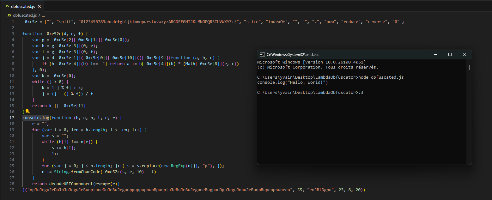

# **LambdaTest-Deobfuscator**

A tool to statically deobfuscate a program protected by Lambdatest, just for fun — because I was bored and also because I missed doing this. :3

*(This program wasn’t made to be pretty, just to entertain myself.)*

<details>
<summary>click here :3</summary>

To explain how LambdaTest works (and how my deobfuscator handles it), I took a simple "Hello World" example and obfuscated it:

```js 
_0xc5e=["","split","0123456789abcdefghijklmnopqrstuvwxyzABCDEFGHIJKLMNOPQRSTUVWXYZ+/","slice","indexOf","","",".","pow","reduce","reverse","0"];function _0xe52c(d,e,f){var g=_0xc5e[2][_0xc5e[1]](_0xc5e[0]);var h=g[_0xc5e[3]](0,e);var i=g[_0xc5e[3]](0,f);var j=d[_0xc5e[1]](_0xc5e[0])[_0xc5e[10]]()[_0xc5e[9]](function(a,b,c){if(h[_0xc5e[4]](b)!==-1)return a+=h[_0xc5e[4]](b)*(Math[_0xc5e[8]](e,c))},0);var k=_0xc5e[0];while(j>0){k=i[j%f]+k;j=(j-(j%f))/f}return k||_0xc5e[11]}eval(function(h,u,n,t,e,r){r="";for(var i=0,len=h.length;i<len;i++){var s="";while(h[i]!==n[e]){s+=h[i];i++}for(var j=0;j<n.length;j++)s=s.replace(new RegExp(n[j],"g"),j);r+=String.fromCharCode(_0xe52c(s,e,10)-t)}return decodeURIComponent(escape(r))}("npJuJeguJeDuJnJuJeguJeBunptuneDuJeBuJegunpguppupnunBpunptuJeBuJeBuJeguneBugpunDguJeguJnnuJeBunpBupeupnuneeu",55,"enJBtDgpu",23,8,20))
```

First, I beautified the code using something like [de4js](https://lelinhtinh.github.io/de4js/), which gave me:

```js
_0xc5e = ["", "split", "0123456789abcdefghijklmnopqrstuvwxyzABCDEFGHIJKLMNOPQRSTUVWXYZ+/", "slice", "indexOf", "", "", ".", "pow", "reduce", "reverse", "0"];

function _0xe52c(d, e, f) {
    var g = _0xc5e[2][_0xc5e[1]](_0xc5e[0]);
    var h = g[_0xc5e[3]](0, e);
    var i = g[_0xc5e[3]](0, f);
    var j = d[_0xc5e[1]](_0xc5e[0])[_0xc5e[10]]()[_0xc5e[9]](function (a, b, c) {
        if (h[_0xc5e[4]](b) !== -1) return a += h[_0xc5e[4]](b) * (Math[_0xc5e[8]](e, c))
    }, 0);
    var k = _0xc5e[0];
    while (j > 0) {
        k = i[j % f] + k;
        j = (j - (j % f)) / f
    }
    return k || _0xc5e[11]
}
eval(function (h, u, n, t, e, r) {
    r = "";
    for (var i = 0, len = h.length; i < len; i++) {
        var s = "";
        while (h[i] !== n[e]) {
            s += h[i];
            i++
        }
        for (var j = 0; j < n.length; j++) s = s.replace(new RegExp(n[j], "g"), j);
        r += String.fromCharCode(_0xe52c(s, e, 10) - t)
    }
    return decodeURIComponent(escape(r))
}("npJuJeguJeDuJnJuJeguJeBunptuneDuJeBuJegunpguppupnunBpunptuJeBuJeBuJeguneBugpunDguJeguJnnuJeBunpBupeupnuneeu", 55, "enJBtDgpu", 23, 8, 20))
```

We immediately notice an `eval`, two functions, and an array `_0xc5e` holding values only used in `_0xe52c`.

Dynamically deobfuscating this is... way too easy. Just replace the `eval` with a `console.log`:



But since that took me all of one second, I wanted to go deeper and make a completely static deobfuscator. :3

So, to statically deobfuscate everything, we start by replacing the `_0xc5e` lookups directly in the function, like so:

```js
function _0xe52c(d, e, f) {
    var g = "0123456789abcdefghijklmnopqrstuvwxyzABCDEFGHIJKLMNOPQRSTUVWXYZ+/"["split"]("");
    var h = g["slice"](0, e);
    var i = g["slice"](0, f);
    var j = d["split"]("")[ "reverse" ]()[ "reduce" ](function (a, b, c) {
        if (h["indexOf"](b) !== -1) return a += h["indexOf"](b) * (Math["pow"](e, c))
    }, 0);
    var k = "";
    while (j > 0) {
        k = i[j % f] + k;
        j = (j - (j % f)) / f
    }
    return k || "0";
}
```

Still not super readable… But hey, `g["split"]("")` is the same as `g.split("")`, so let’s clean it up:

```js
function _0xe52c(d, e, f) {
    var g = "0123456789abcdefghijklmnopqrstuvwxyzABCDEFGHIJKLMNOPQRSTUVWXYZ+/".split("");
    var h = g.slice(0, e);
    var i = g.slice(0, f);
    var j = d.split("").reverse().reduce(function (a, b, c) {
        if (h.indexOf(b) !== -1) return a += h.indexOf(b) * Math.pow(e, c);
    }, 0);
    var k = "";
    while (j > 0) {
        k = i[j % f] + k;
        j = (j - (j % f)) / f;
    }
    return k || "0";
}
```

Now, let’s look at the second function:

```js
(function (h, u, n, t, e, r) {
    r = "";
    for (var i = 0, len = h.length; i < len; i++) {
        var s = "";
        while (h[i] !== n[e]) {
            s += h[i];
            i++
        }
        for (var j = 0; j < n.length; j++) s = s.replace(new RegExp(n[j], "g"), j);
        r += String.fromCharCode(_0xe52c(s, e, 10) - t)
    }
    return decodeURIComponent(escape(r))
})("npJuJeguJeDuJnJuJeguJeBunptuneDuJeBuJegunpguppupnunBpunptuJeBuJeBuJeguneBugpunDguJeguJnnuJeBunpBupeupnuneeu", 55, "enJBtDgpu", 23, 8, 20)
```

We can see some unused parameters like `u` and `r`.
Also, this part in `_0xe52c`:

```js
    var k = "";
    while (j > 0) {
        k = i[j % f] + k;
        j = (j - (j % f)) / f;
    }
    return k || "0";
```

…is completely useless, since the base is 10 in `_0xe52c(s, e, 10)` — it's always decimal.

And `decodeURIComponent(escape(r))`?
Yeah, that’s just a roundabout way of writing `r`.

So here’s the cleaned-up final version:

```js
function _0xe52c(d, e) {
    var g = "0123456789abcdefghijklmnopqrstuvwxyzABCDEFGHIJKLMNOPQRSTUVWXYZ+/".split("");
    var h = g.slice(0, e);
    var i = g.slice(0, 10);
    var j = d.split("").reverse().reduce(function (a, b, c) {
        if (h.indexOf(b) !== -1) return a += h.indexOf(b) * Math.pow(e, c);
    }, 0);
    return j;
}

eval(function (h, n, t, e) {
    r = "";
    for (var i = 0, len = h.length; i < len; i++) {
        var s = "";
        while (h[i] !== n[e]) {
            s += h[i];
            i++
        }
        for (var j = 0; j < n.length; j++) s = s.replace(new RegExp(n[j], "g"), j);
        r += String.fromCharCode(_0xe52c(s, e) - t)
    }
    return r;
}("npJuJeguJeDuJnJuJeguJeBunptuneDuJeBuJegunpguppupnunBpunptuJeBuJeBuJeguneBugpunDguJeguJnnuJeBunpBupeupnuneeu", "enJBtDgpu", 23, 8))
```

For my deobfuscator, I just reused these two functions to decode the payload.

Pretty straightforward…

I also used a regex to extract the parameters:

```js
/\s*"[0-9A-Z+/]+"\s*,\s*[0-9]+\s*,\s*"[0-9A-Z+/]+"\s*,\s*[0-9]+\s*,\s*[0-9]+\s*,\s*[0-9]+\s*/i
```

Then I extracted the key ones:

```js
const obfuscatedStr = parameters[0].replace(/"/g, "");
const alphabet = parameters[2].replace(/"/g, "");
const offset = parseInt(parameters[3], 10);
const base = parseInt(parameters[4], 10);
```

And finally, just rewrote the logic to decode the message.

Nothing crazy...
I was just bored.


</details>